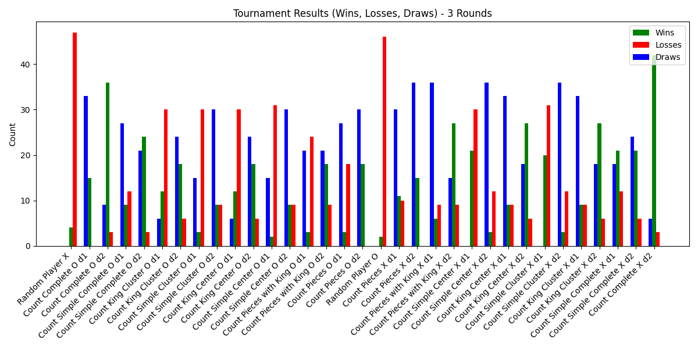
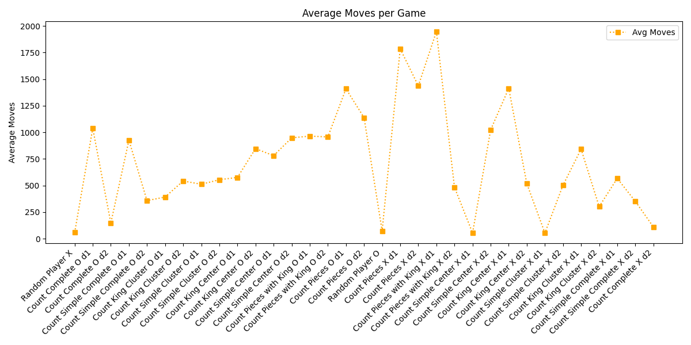
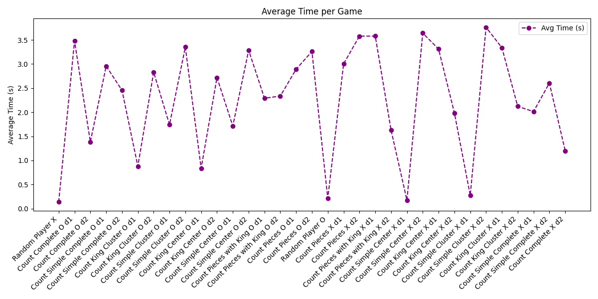
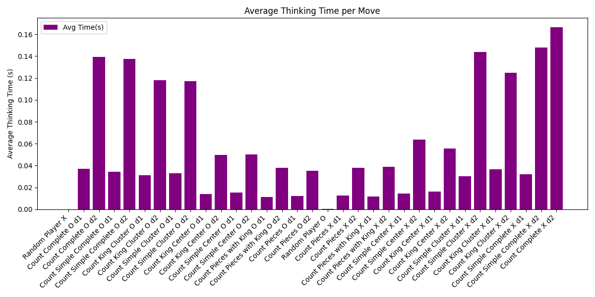

# 📱 Checkers Mobile App

A mobile checkers game built using **React Native** and a **Flask** backend, featuring a custom AI opponent that uses **Alpha-Beta Pruning** and multiple heuristic evaluation strategies.

## 🚀 Features

- Alpha-beta pruning AI engine
- Multiple heuristic strategies (piece count, kings, center control, clustering, advancement, etc.)
- Mobile-friendly UI with React Native
- Play against AI with 4 difficulty levels
- Game-over detection and restart option

## 🛠️ Requirements

### Frontend (React Native)
- Node.js
- `npm` or `yarn`
- React Native CLI or Expo

### Backend (Flask)
- Python 3.9+
- `flask`
- `flask-cors`

## ▶️ Usage

### Clone the repo
```bash
git clone https://github.com/your-username/checkers_mobile_app.git
cd checkers_mobile_app
```

### Start the backend server
```bash
cd backend
pip install -r requirements.txt
python app.py
```

### Run the mobile app
```bash
cd ../frontend
npm install
npx react-native run-ios   # or use run-android for Android
```

Make sure your frontend points to the correct backend URL (e.g., http://localhost:5000).


## 📊 Tournament Analysis

### 
**Figure 1: Wins, losses, and draws of a 3-round tournament between different evaluation functions.**  
Players with a more complete understanding of checkers, such as the "Count Complete" bots, performed the best, while the Random Player was the weakest. Draws were more common among complex evaluators, likely due to slow decision-making leading to timeouts. Players on the X side had a noticeable advantage from going first.

---

### 
**Figure 2: Average moves per game of each AI player in a 3-round tournament.**  
A clear correlation exists between a high number of moves and a high draw rate. These lengthy games suggest not indecision, but difficulty reaching a win condition. Simpler evaluators played more moves, and O-side players were generally more consistent across depth variations.

---

### 
**Figure 3: Average time elapsed per game of each AI player.**  
Regardless of evaluation complexity, depth-2 players consistently took between 2 and 3.5 seconds per game. This shows that **search depth** was the biggest factor in determining game duration, more than evaluation strategy.

---

### 
**Figure 4: Average time spent thinking per move by each AI player.**  
Depth-2 players took significantly longer per move compared to depth-1 players. Evaluators with simpler logic ran faster, but depth had a much greater impact than heuristic complexity. This supports conclusions drawn from total game time.


